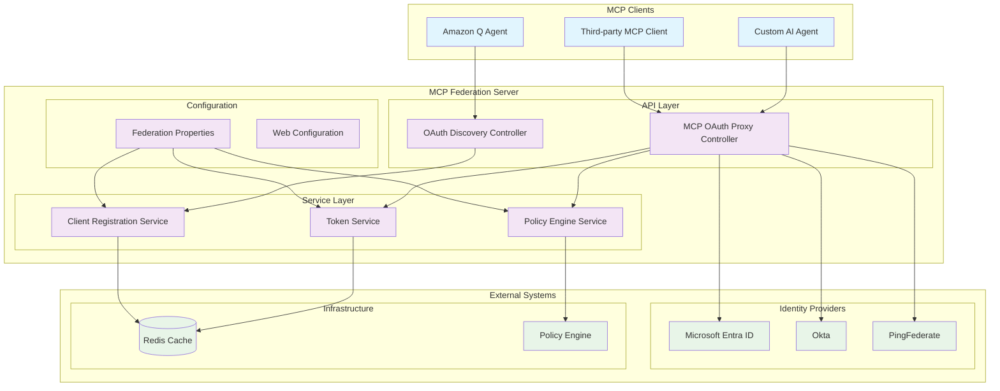
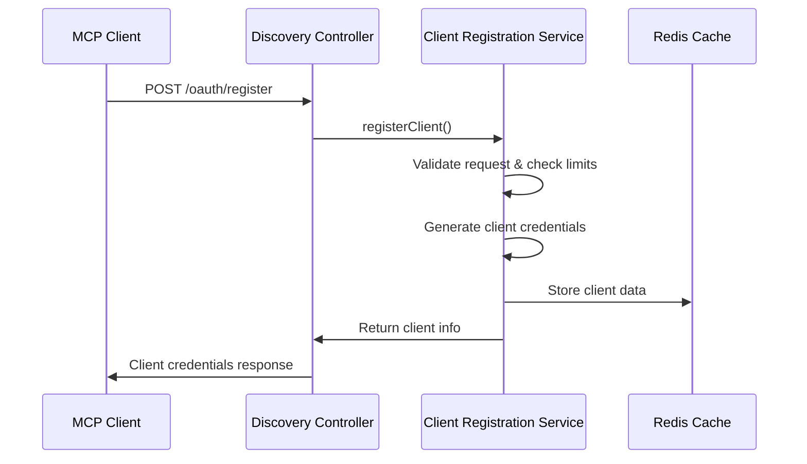
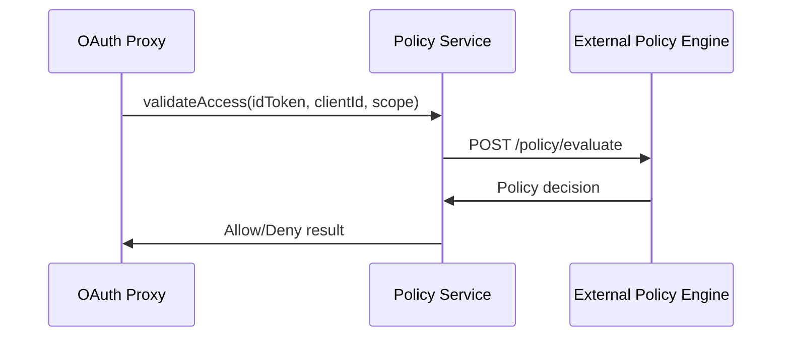
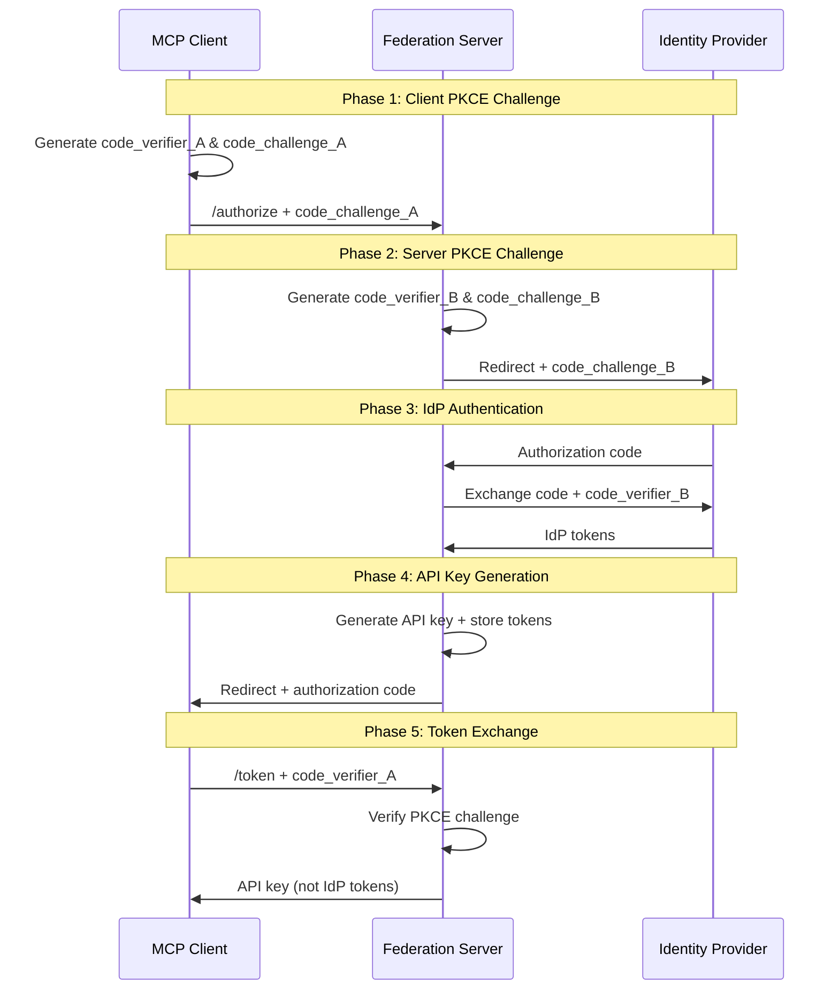
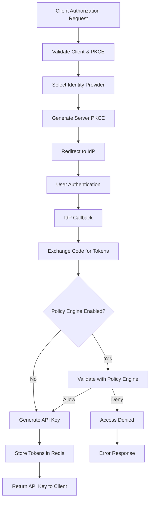
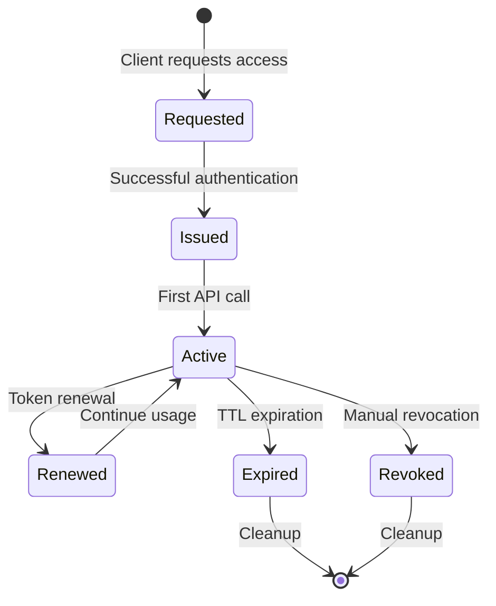
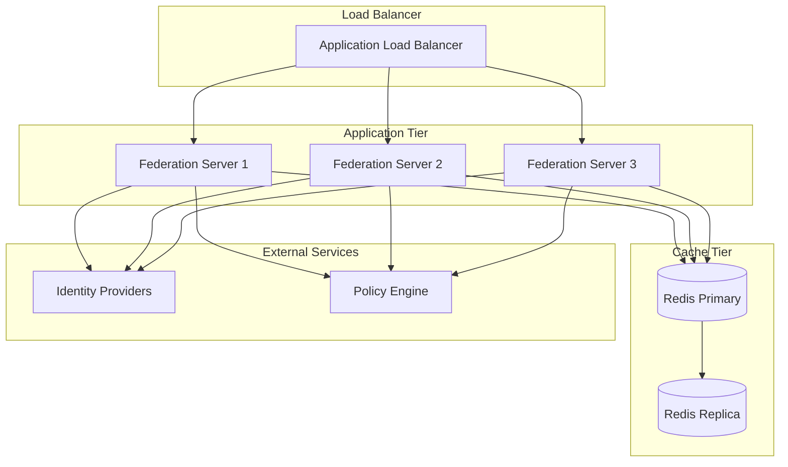
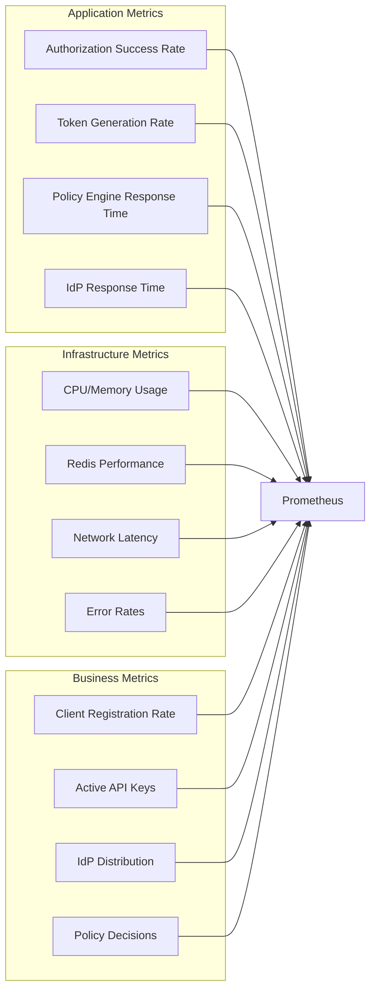

# MCP Identity Federation Server - Architecture

## Overview

The MCP Identity Federation Server implements a sophisticated authorization proxy pattern that enables secure, scalable authentication for Model Context Protocol (MCP) implementations in enterprise environments. This architecture addresses the complex challenges of multi-Identity Provider federation while maintaining the security and simplicity required for AI-driven systems.

## Architectural Principles

### 1. **Identity Abstraction**
The server acts as an intelligent intermediary between MCP clients and enterprise Identity Providers, completely abstracting IdP complexity from AI agents while maintaining OAuth2 security standards.

### 2. **Dual PKCE Security**
Implements a dual Proof Key for Code Exchange (PKCE) flow:
- **Client PKCE**: Validates challenges from MCP clients
- **Server PKCE**: Generates separate challenges for IdP communication

### 3. **Token Abstraction**
Converts IdP tokens into MCP-specific API keys, ensuring that sensitive IdP tokens never leave the federation server while providing clients with simple, secure credentials.

### 4. **Fail-Safe Design**
Implements secure defaults with fail-closed behavior, ensuring that security failures result in access denial rather than unauthorized access.

## System Architecture



## Component Architecture

### API Layer

#### OAuth Discovery Controller
**Purpose**: Provides OAuth2 discovery and dynamic client registration capabilities

**Key Responsibilities**:
- Exposes OAuth2 authorization server metadata (RFC 8414)
- Handles dynamic client registration (RFC 7591)
- Manages client credential generation and validation
- Implements IP-based rate limiting for client registration

**Endpoints**:
- `GET /.well-known/oauth-authorization-server` - OAuth2 metadata
- `POST /oauth/register` - Dynamic client registration
- `GET /oauth/client/{clientId}` - Client information retrieval

#### MCP OAuth Proxy Controller
**Purpose**: Implements the core OAuth2 PKCE proxy functionality

**Key Responsibilities**:
- Orchestrates dual PKCE flows between clients and IdPs
- Manages authentication sessions and state
- Generates and validates API keys
- Integrates with policy engines for additional authorization
- Handles token renewal and expiration

**Endpoints**:
- `GET /oauth/authorize` - Authorization initiation
- `GET /oauth/callback/{idpName}` - IdP callback handling
- `POST /oauth/token` - Token exchange
- `POST /oauth/renew` - Token renewal

### Service Layer

#### Token Service
**Purpose**: Manages API key lifecycle and IdP token storage

**Key Features**:
- Redis-based distributed token storage
- Automatic token expiration via TTL
- Thread-safe token operations
- Token validation and renewal logic
- Secure token masking for logging

**Cache Strategy**:
```java
@Cacheable(value = "mcp-tokens", key = "#apiKey")
public TokenData getTokenData(String apiKey)

@CachePut(value = "mcp-tokens", key = "#apiKey") 
public void storeTokenData(String apiKey, TokenData tokenData)

@CacheEvict(value = "mcp-tokens", key = "#apiKey")
public void removeTokenData(String apiKey)
```

#### Client Registration Service
**Purpose**: Manages OAuth2 client registrations and credentials

**Key Features**:
- Dynamic client registration with validation
- Client credential management and rotation
- IP-based rate limiting and abuse prevention
- Client information retrieval and validation
- Support for multiple grant types and scopes

**Registration Flow**:


#### Policy Engine Service
**Purpose**: Integrates with external policy engines for fine-grained authorization

**Key Features**:
- HTTP-based policy engine integration
- JWT token validation with external policies
- Configurable timeout and error handling
- Support for multiple policy engine formats (OPA, custom)
- Fail-closed security behavior

**Policy Evaluation Flow**:


## Security Architecture

### Dual PKCE Implementation

The server implements a sophisticated dual PKCE flow that maintains security while providing abstraction:



### Token Security Model

#### API Key Structure
```json
{
  "api_key": "mcp_ak_7f9d2e1a8b3c4d5e6f7g8h9i0j1k2l3m",
  "properties": {
    "high_entropy": "256-bit cryptographic randomness",
    "prefix": "mcp_ak_ for easy identification",
    "opaque": "No embedded information",
    "time_bound": "Configurable expiration"
  }
}
```

#### Token Storage Security
- **Encryption at Rest**: Redis with encryption enabled
- **Encryption in Transit**: TLS for all communications
- **Access Controls**: Network-level and application-level restrictions
- **Audit Logging**: Comprehensive token operation logging
- **Automatic Cleanup**: TTL-based token expiration

### Policy Engine Integration

The server supports optional integration with external policy engines for enhanced authorization:

#### Policy Request Format
```json
{
  "input": {
    "token": "eyJhbGciOiJSUzI1NiIs...",
    "client_id": "550e8400-e29b-41d4-a716-446655440000",
    "scope": "mcp:read mcp:write",
    "timestamp": 1705312200,
    "action": "mcp_access",
    "context": {
      "ip_address": "192.168.1.100",
      "user_agent": "MCP-Client/1.0"
    }
  }
}
```

#### Policy Response Formats
```json
// OPA Format
{"result": true}

// Alternative Format
{"allow": true}

// Decision Format  
{"decision": "allow"}
```

## Data Flow Architecture

### Authorization Flow


### Token Lifecycle Management


## Configuration Architecture

### Multi-IdP Configuration
The server supports flexible Identity Provider configuration:

```yaml
mcp:
  federation:
    identity-providers:
      entra-id:
        enabled: true
        type: oidc
        client-id: ${ENTRA_CLIENT_ID}
        client-secret: ${ENTRA_CLIENT_SECRET}
        tenant-id: ${ENTRA_TENANT_ID}
        auth-endpoint: https://login.microsoftonline.com/{tenant}/oauth2/v2.0/authorize
        token-endpoint: https://login.microsoftonline.com/{tenant}/oauth2/v2.0/token
        
      okta:
        enabled: false
        type: oidc
        client-id: ${OKTA_CLIENT_ID}
        client-secret: ${OKTA_CLIENT_SECRET}
        domain: ${OKTA_DOMAIN}
        auth-endpoint: https://{domain}/oauth2/v1/authorize
        token-endpoint: https://{domain}/oauth2/v1/token
```

### Dynamic IdP Selection
The server implements intelligent IdP selection based on:
1. **Explicit Hints**: `idp_hint` parameter in authorization requests
2. **Availability**: Only enabled IdPs are considered
3. **Fallback**: First available IdP if no hint provided

## Deployment Architecture

### Standalone Deployment


### Kubernetes Deployment
```yaml
apiVersion: apps/v1
kind: Deployment
metadata:
  name: mcp-federation-server
spec:
  replicas: 3
  strategy:
    type: RollingUpdate
    rollingUpdate:
      maxSurge: 1
      maxUnavailable: 0
  template:
    spec:
      containers:
      - name: mcp-federation
        image: mcp-federation-server:latest
        resources:
          requests:
            memory: "512Mi"
            cpu: "250m"
          limits:
            memory: "1Gi"
            cpu: "500m"
        livenessProbe:
          httpGet:
            path: /mcp-federation/actuator/health
            port: 8080
          initialDelaySeconds: 30
          periodSeconds: 10
        readinessProbe:
          httpGet:
            path: /mcp-federation/actuator/health
            port: 8080
          initialDelaySeconds: 5
          periodSeconds: 5
```

## Performance Architecture

### Caching Strategy
- **L1 Cache**: Application-level caching for frequently accessed data
- **L2 Cache**: Redis distributed cache for token and client data
- **TTL Management**: Automatic expiration aligned with token lifetimes
- **Cache Warming**: Proactive cache population for critical data

### Scalability Patterns
- **Horizontal Scaling**: Stateless application design enables easy scaling
- **Load Distribution**: Intelligent load balancing across instances
- **Circuit Breakers**: Resilience patterns for external dependencies
- **Connection Pooling**: Optimized database and HTTP connections

### Performance Targets
| Metric | Target | Measurement |
|--------|--------|-------------|
| Authorization Latency | < 200ms P95 | End-to-end OAuth flow |
| Token Validation | < 10ms P95 | API key validation |
| Throughput | 5,000 RPS | Concurrent authorization requests |
| Availability | 99.9% | Monthly uptime |
| Cache Hit Rate | > 95% | Token and client lookups |

## Monitoring and Observability

### Metrics Collection


### Health Checks
- **Application Health**: Spring Boot Actuator health endpoints
- **Dependency Health**: Redis connectivity and IdP availability
- **Custom Health**: Policy engine integration status
- **Deep Health**: End-to-end flow validation

## Security Considerations

### Threat Model
1. **Token Theft**: Mitigated by API key abstraction
2. **Replay Attacks**: Prevented by PKCE implementation
3. **Man-in-the-Middle**: Mitigated by TLS enforcement
4. **Credential Stuffing**: Prevented by rate limiting
5. **Policy Bypass**: Mitigated by fail-closed design

### Security Controls
- **Input Validation**: Comprehensive request validation
- **Output Encoding**: Safe response formatting
- **Error Handling**: Secure error messages without information leakage
- **Audit Logging**: Comprehensive security event logging
- **Rate Limiting**: Protection against abuse and DoS attacks

## Future Enhancements

### Planned Features
1. **Token Refresh**: Automatic token refresh using refresh tokens
2. **Advanced Policies**: Support for more complex policy engines
3. **Multi-Region**: Cross-region token synchronization
4. **Analytics**: Advanced usage analytics and reporting
5. **Federation Standards**: Support for SAML and other federation protocols

### Scalability Roadmap
1. **Microservices**: Split into specialized microservices
2. **Event-Driven**: Implement event-driven architecture
3. **Streaming**: Real-time token and policy updates
4. **AI Integration**: ML-based anomaly detection and risk scoring

This architecture provides a robust, secure, and scalable foundation for MCP identity federation in enterprise environments, enabling organizations to leverage AI-driven automation while maintaining the highest security and compliance standards.